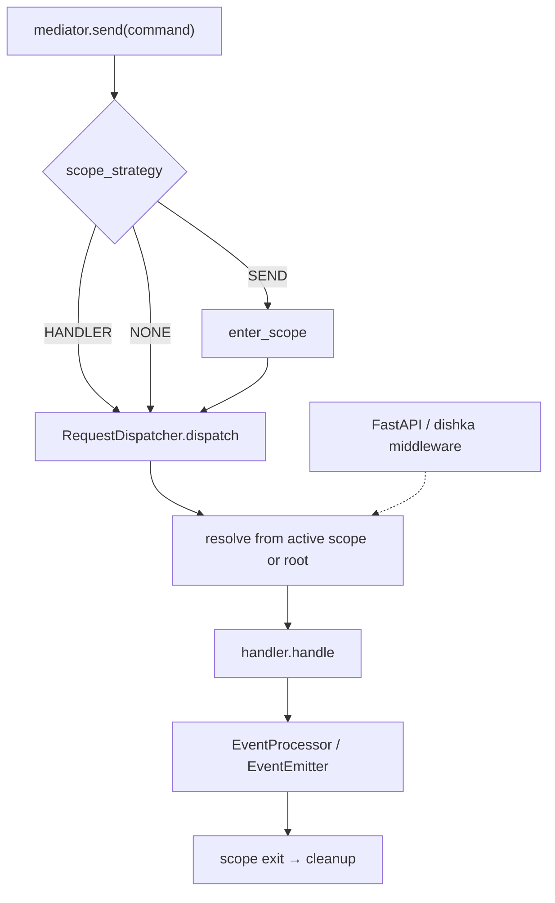

# Advanced

<div class="grid cards" markdown>

-   :material-home: **Back to Scoped Dependencies Overview**

    Return to the Scoped Dependencies overview page with all topics.

    [:octicons-arrow-left-24: Back to Overview](index.md)

-   :material-code-tags: **Custom Container**

    Implement `SupportsScope` when you are not using `di` or dishka.

    [:octicons-arrow-right-24: Read More](custom_container.md)

</div>

---

Stay on the [Tutorial](tutorial.md) unless you need one of these:

- several `mediator.send()` calls in **one** UoW
- a scope already opened by FastAPI / dishka middleware (`bind_scope`)
- streams, sagas, or `recover_saga` with the same strategy as bootstrap



## Several `send()` calls, one UoW

`enter_scope` opens a scope and inner **SEND** `send()` calls **join** it (`reuse_existing=True` by default). HANDLER never joins; it always nests.

```python
import cqrs

async with cqrs.enter_scope(container):
    await mediator.send(ReserveStock(...))
    await mediator.send(ChargePayment(...))
```

Use this for a multi-command unit of work. One command still only needs `scope_strategy=ScopeStrategy.SEND` on bootstrap — no manual `enter_scope`.

## FastAPI / dishka middleware (`bind_scope`)

When middleware already opened a scoped container, attach it so **SEND** (or **NONE**) resolves reuse that instance:

```python
from fastapi import Depends, FastAPI, Request

import cqrs
from cqrs.container.dishka import DishkaCQRSContainer
from cqrs.container.scope import bind_scope

app = FastAPI()

@app.post("/tasks/{task_id}/cancel")
async def cancel(
    task_id: int,
    request: Request,
    mediator: cqrs.RequestMediator = Depends(...),
):
    async with bind_scope(DishkaCQRSContainer.of(request.state.dishka_container)):
        await mediator.send(CancelTask(task_id=task_id))
```

CLI / no-FastAPI equivalent: [`examples/di/scoped_dependencies_fastapi.py`](https://github.com/vadikko2/python-cqrs/blob/master/examples/di/scoped_dependencies_fastapi.py).

!!! warning "`bind_scope` + HANDLER"
    HANDLER always opens a **nested** scope (`reuse_existing=False`). Command and domain-event handlers will **not** share the middleware UoW. Use SEND when you want that sharing.

## Streams

Under **SEND**, the mediator opens one scope around the whole stream (inside the async generator). Consume it fully or close it:

```python
from contextlib import aclosing

async with aclosing(mediator.stream(command)) as stream:
    async for result in stream:
        ...
```

An abandoned SEND stream holds the UoW until garbage collection. Prefer short-lived streams. Details: [Stream configuration](../stream_handling/configuration.md).

## Sagas and recovery

- **SEND** — one UoW for the whole saga, including compensation and fallback. Preferred when steps share a session.
- **HANDLER** — a new scope per step. Compensation **re-resolves** the step, so do not keep compensation state on `self`; put it in `SagaContext`.

Pass the **same** `scope_strategy` to `saga.transaction(...)` and `recover_saga(...)` as the original run. A plain `di.Container` is enough — do not wrap it yourself.

Do not call `recover_saga` from a `send()` that already opened SEND: recovery would join that request UoW.

See [Saga Recovery](../saga/recovery.md) and [Compensation](../saga/compensation.md).
