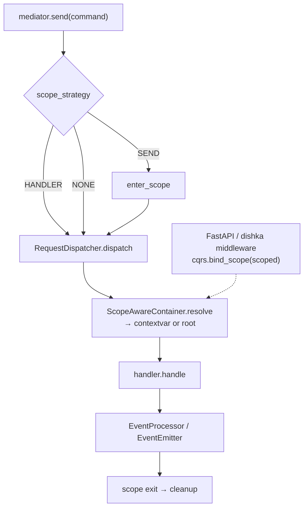

# Scoped Dependencies

python-cqrs can keep a DI **scope** open for the duration of command / event handling so generator providers (`async def uow() -> AsyncIterator[IUoW]: ... yield uow`) finalize **after** `handle`, not before. Scopes are opt-in: pass `scope_strategy=ScopeStrategy.SEND` (or `HANDLER`) to bootstrap, since the default `ScopeStrategy.NONE` opens no framework scopes.



## What you get

| Capability | Description |
|------------|-------------|
| Generator providers | UoW / sessions stay alive until the scope exits |
| Shared UoW (SEND) | Command, its fallback, and domain-event handlers see the same instance |
| Per-handler UoW (HANDLER) | Each resolve+handle gets a fresh scope, **including fallback** (primary rolls back first) |
| No framework scopes (NONE) | Default; one-shot resolve, same as before scoped dependencies |
| External scopes | `bind_scope` attaches a scope opened by FastAPI/dishka middleware |
| Multi-command UoW | Wrap several `send()` calls in `async with enter_scope(...)` |

## Quick start

```python
async def uow_provider() -> typing.AsyncIterator[IUoW]:
    async with create_uow() as uow:
        yield uow

container = di.Container()
container.bind(di.bind_by_type(dependent.Dependent(uow_provider, scope="request"), IUoW))

mediator = bootstrap.bootstrap(
    di_container=container,
    commands_mapper=...,
    scope_strategy=ScopeStrategy.SEND,
)
await mediator.send(CancelTask(task_id=1))  # cleanup runs after handle
```

`RequestMediator(..., SEND)`, `saga.bootstrap(..., SEND)`, and `StreamingRequestMediator(..., SEND)` construct with sequential events (`concurrent_event_handle_enable=None` → `False`). Do not pass `concurrent_event_handle_enable=True` with SEND.

!!! note "Default `NONE`"
    Without an explicit `scope_strategy=`, the mediator opens no scopes and dependencies resolve exactly as in releases before scoped dependencies existed. Details: [Strategies](strategies.md).

## Next

- [Why scoped dependencies](why.md)
- [Strategies (`SEND` / `HANDLER` / `NONE`)](strategies.md)
- [Containers (`di`, dishka, dependency-injector)](containers.md)
- [Custom container](custom_container.md)
- [Troubleshooting](troubleshooting.md)
